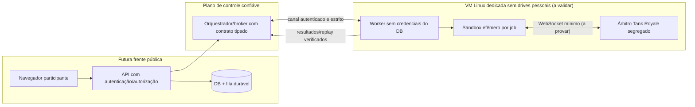

# ADR-004 — Fronteira de execução não confiável (candidata)

**Status:** direção de VM dedicada aprovada pelo responsável (D-005). Instalação, rede, árbitro e homologação permanecem pendentes; I1 testa controles em CI, não Hyper-V do host.  
**Vinculação:** S04-T04; ameaça prioritária TH-01/TH-02/TH-05/TH-15; feature 004 do Spec Kit.

## Problema

A RoboCopa será hospedada inicialmente em computador pessoal que executa outros projetos. O protótipo atual recebe RoboDSL em loopback e o processo Python do host acessa a CLI Docker. A política `--network none`, `read-only`, limites e usuário não root demonstrada nos spikes com exemplos oficiais **não isola o daemon compartilhado e não permite abrir o laboratório ao público**.

## Alternativas

- **A — Docker Desktop compartilhado endurecido:** custo menor e compatibilidade imediata, mas mantém superfícies de kernel/daemon/host com outros projetos. **Rejeitada como única fronteira para código não confiável**.
- **B — VM Linux dedicada ao worker e ao runtime, sem drives montados:** melhor fronteira entre os dados pessoais e as tarefas de aluno, com política de rede limitada e snapshot/recovery. **Candidata preferida**.
- **C — worker em hardware/nuvem externa isolada:** boa separação física, mas dependente de custo, upload e operação. Plano alternativo se B falhar.
- **D — gVisor ou rootless/user namespaces:** defesas **adicionais** a investigar em B/C, não substitutos automáticos de VM nem cobertura da confiança no árbitro.

## Direção candidata (não aprovada)

1. API não possui socket do Docker nem executa shell com entrada do aluno.
2. Broker transmite apenas `ExecutionRequest` tipada e imutável com token mínimo do worker e deadline.
3. Worker executa numa VM Linux **própria e restrita**, com runtime independente de contêineres e dados pessoais.
4. Bot em sandbox efêmero distinto do processo árbitro (a viabilidade de comunicação Battle Runner/booter deve ser testada; não assumir que versão 1.4.0 já suporta essa composição sem adaptação).
5. Worker retorna resultado/replay sob controle de esquema, hash e identidade; logs sanitarizados.
6. Worker ausente, violação ou política inválida → **execução negada**. Nunca migrar automaticamente para execução na API/host.
7. Em laboratório, preservar isolamento total de internet; futura conexão com frontend requer autorização, TLS e identidade própria, e não é objeto desta ADR.

## Pontos em aberto que impedem aprovação

- Viabilidade de VM no Windows com proteção efetiva de arquivos/VM disks e separação de rede.
- Semântica e isolamento do canal WebSocket entre bot e árbitro sem conceder internet ou acesso ao host.
- Modelo de credenciais/identidade da interface worker/broker; necessidade de persistência e attestation.
- Quotas, timeout, tratamento de crash e verificação de cleanup calibrados.
- Local do disco virtual Docker Desktop, backup independente, disponibilidade e conservação de evidências.
- D1 resolvida: RoboDSL básica no MVP, linguagens gerais pós-MVP. Detalhamento funcional/pedagógico e liberação de alunos ainda pendentes.
- Em caso de empate (issue #15), regra de ranking externa ao motor deve ser definida na S03-T03.

## Efeitos e alternativa de segurança imediata

**Enquanto não houver separação verificada:** apenas demonstrações locais com bots oficiais e RoboDSL do responsável. Não abrir a porta 18081, não permitir cadastro/submissão de alunos nem executar código geral. Se B não puder atender às condições de segurança, manter o serviço desabilitado para estudantes ou estudar C, sem sacrificar integridade do host pessoal.

## Revisão e aceite

Exigir resultados reais das tarefas de S04-T04, análise da constituição, revisão do responsável e registros de falhas não resolvidas. Nenhuma aprovação implícita resulta do fato de este arquivo existir.
