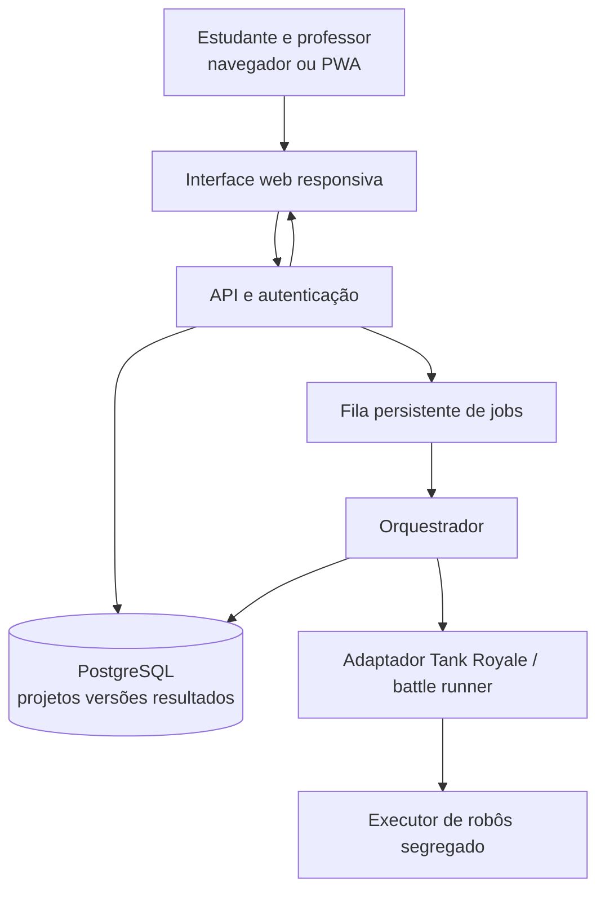

# Visão da arquitetura candidata — RoboCopa IFMA

**Estado:** rascunho técnico. Requisitos S03, spikes S04 e ratificação ainda pendentes.

## Contexto de produto

Participantes acessam via celular/computador, aprendem lógica de programação, produzem estratégias próprias de robô, salvam versões, testam e participam de uma competição. Professores/orientadores observam progresso e organizadores controlam inscrições, partidas e resultados.

## Componentes futuros (não implementados)

A API do Tank Royale usa WebSocket para interação entre motor, bots e observadores/controladores: https://robocode.dev/articles/tank-royale.html.

## Contratos futuros

- `POST /treinos` (proposta) recebe versão *imutável* de código/estratégia, retorna ID de execução.
- `GET /treinos/{id}` (proposta) retorna estado, log pedagógico filtrado e resultado rastreável.
- `POST /inscricoes` (proposta) vincula versão congelada ao torneio e regras aplicáveis.
- Eventos do motor serão normalizados pelo adaptador, incluindo falhas, timeout e reexecução autorizada.

Os nomes de endpoint e os contratos **não** são baseline aprovada. Precisam nascer dos RF/RNF/RN e dos testes com o motor real.

## Primeira infraestrutura executável

`compose.local.yaml` mantém apenas PostgreSQL privado e sonda Node pública **somente no loopback**. Não executa API do produto, motor ou código de alunos. Seu objetivo é provar que podemos controlar inicialização, isolamento básico dos serviços, saúde e persistência sem mexer nos outros projetos do host.

## Decisões abertas

- Forma de programação dos robôs no celular (deve permitir alteração real da estratégia).
- Versão oficial do motor e interface do battle runner, após spike real.
- Sandbox efetivo para código não confiável (Docker isolado, eventualmente VM dedicada), revisão e limites.
- Acesso público/autenticado pela internet, segurança de estudantes, CGNAT e TLS.
- Local físico do disco virtual Docker, capacidade e backup/restauração.

Ver `ADR-001-stack.md`, `ADR-003-hospedagem.md` e `docs/operacao/COMPOSE-LOCAL.md`.
